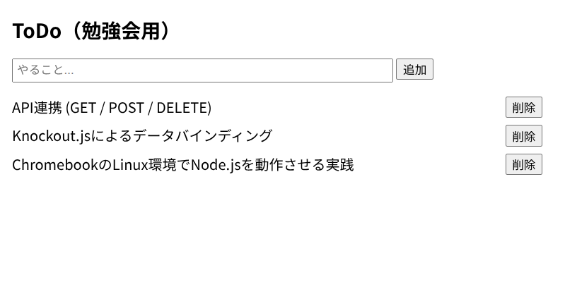

# 📝 Knockout.js × Node.js Mini ToDo App

This is a small full-stack ToDo app built as a study exercise.
Froontend: **Knockout.js**
Backend: **Node.js (Express)**

## 🚀 How to Run
```bash
npm install 
npm start

## 📸 Scrrenshot

